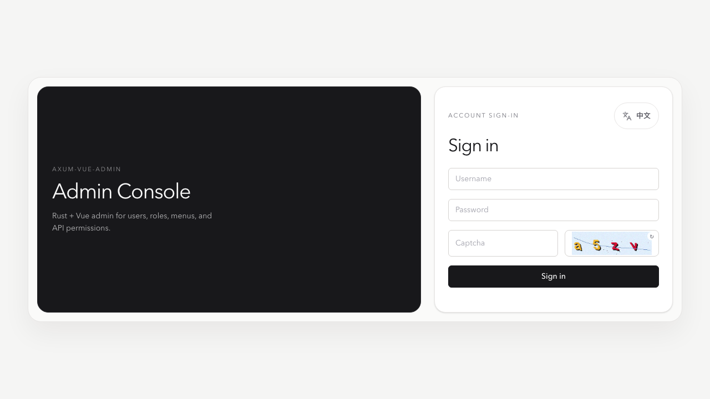
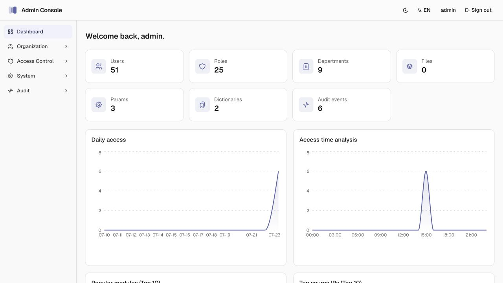
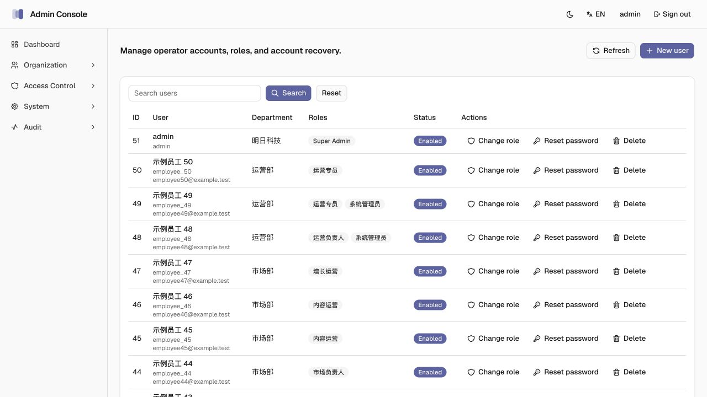
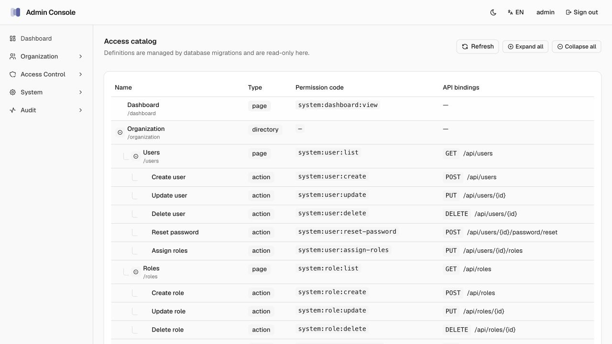

# axum-admin

[Rust](https://github.com/nivek-ph/axum-admin/actions/workflows/rust.yml)
[License: MIT](LICENSE)

An extensible Rust full-stack admin foundation for internal tools, SaaS consoles, and B2B
operations. It pairs an Axum + SQLx + PostgreSQL API with a React + Vite Admin Console.

[Live Demo](https://axum-admin-web.vercel.app) · [Quick Start](#quick-start) ·
[IAM Architecture](docs/architecture/iam.md) · [Swagger UI](http://127.0.0.1:3000/swagger-ui/)

[Deploy existing projects with Vercel](https://github.com/nivek-ph/axum-admin/actions/workflows/vercel.yml)

axum-admin dashboard

## Features

- Axum REST API with SQLx, PostgreSQL, OpenAPI, and Swagger UI
- React Admin Console with Vite, TanStack Query, TanStack Table, and shadcn/ui on Base UI
- Authentication and IAM with users, roles, menus, page access, and concrete permissions
- Departments, parameters, dictionaries, files, profiles, and structured audit events
- Separate API and Admin Console deployment projects on Vercel


## Demo

- URL: [https://axum-admin-web.vercel.app](https://axum-admin-web.vercel.app)
- Username: `admin`
- Password: `123456`

These credentials are for the public demo only. Do not reuse them elsewhere.

## Screenshots









## Quick Start

You need the Rust toolchain pinned in `rust-toolchain.toml`, Node.js with pnpm, PostgreSQL, and
Redis 8 or newer. Create the PostgreSQL database configured by `DATABASE_URL`, then start
PostgreSQL and Redis.

```bash
cp .env.example .env
cargo run -p ava init
cargo run -p ava serve
```

In another terminal:

```bash
cd apps/desktop
pnpm install
pnpm dev
```

Open [http://127.0.0.1:5173](http://127.0.0.1:5173) and sign in with the
`ADMIN_USERNAME` / `ADMIN_PASSWORD` values from `.env`. The API defaults to
`http://127.0.0.1:3000/api`; override it with `VITE_API_BASE_URL` when needed.

## Deployment

The API and Admin Console deploy as separate Vercel projects.

- Maintainers: use the [Deploy existing projects workflow](https://github.com/nivek-ph/axum-admin/actions/workflows/vercel.yml).
- New projects: use the deploy buttons below, then point `VITE_API_BASE_URL` at the deployed API
URL with the `/api` suffix.

Backend:

[](https://vercel.com/new/clone?repository-url=https%3A%2F%2Fgithub.com%2Fnivek-ph%2Faxum-admin&env=HTTP_PORT%2CDATABASE_URL%2CREDIS_URL%2CJWT_SECRET&envDescription=Configure%20the%20backend%20database%2C%20Redis%2C%20and%20JWT%20secret.&envDefaults=%7B%22HTTP_PORT%22%3A%223000%22%7D&envLink=https%3A%2F%2Fgithub.com%2Fnivek-ph%2Faxum-admin%2Fblob%2Fmain%2F.env.example&project-name=axum-admin&repository-name=axum-admin)

Frontend:

[](https://vercel.com/new/clone?repository-url=https%3A%2F%2Fgithub.com%2Fnivek-ph%2Faxum-admin&root-directory=apps%2Fdesktop&env=VITE_API_BASE_URL&envDescription=Enter%20the%20public%20backend%20API%20base%20URL%2C%20including%20%2Fapi.&envLink=https%3A%2F%2Fgithub.com%2Fnivek-ph%2Faxum-admin%2Fblob%2Fmain%2F.env.example&project-name=axum-admin-web&repository-name=axum-admin-web)

See [Vercel deployment](docs/deployment/vercel.md) for project settings, required secrets, and
workflow behavior.

## Architecture

```text
apps/ava           CLI and backend composition root
apps/desktop       React/Vite Admin Console
crates/api         Axum HTTP adapter
crates/audit       business and security audit events
crates/auth        password, token, and captcha helpers
crates/db          database connection and migrations
crates/file-storage
crates/iam         accounts, roles, menus, and access control
crates/metadata    parameters and dictionaries
migrations         SQLx migrations
```

- [IAM architecture](docs/architecture/iam.md)
- [API DTO ownership](docs/architecture/api-dto-ownership.md)

Successful API responses use a shared envelope:

```json
{
  "code": "OK",
  "message": "ok",
  "data": {}
}
```

## Development

```bash
cargo test --workspace
cd apps/desktop && pnpm test && pnpm build
```

The previous Vue 3 + Tauri is available in the
[v1.1.0](https://github.com/nivek-ph/axum-admin/releases/tag/v1.1.0).

Product layout and navigation patterns borrow ideas from
[gin-vue-admin](https://github.com/flipped-aurora/gin-vue-admin). This repository is a separate
Rust + React.

## License

- [MIT License](LICENSE).
