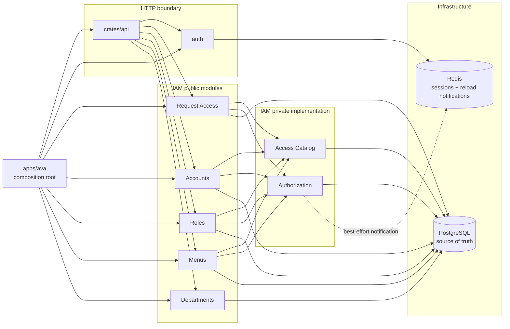

# IAM architecture

Status: implemented on `main` by PR #60 (`ffa4337`)

This document describes the IAM behavior present in the repository. It is the canonical starting
point for changes to `crates/iam`, protected API middleware and routes, IAM migrations, or the Admin
Console access workflows. Local `.notes/iam-module-simplification/` files record design and ticket
history; where they conflict with this document or current code, current code and this document win.

## Responsibility boundaries

| Component | Owns | Does not own |
| --- | --- | --- |
| Request Access (`access`) | One authenticated request admission decision: account status, explicit self-service routes, route-to-Permission resolution, and enforcement | Token/session validation, navigation, access administration, department scope |
| Accounts | User Account facts and lifecycle, persisted password hash, exact-department administration boundary, Assigned Roles, Direct Permissions, Effective Permission sources | Password algorithms, tokens, sessions, JWTs, CAPTCHA, reusable Role configuration |
| Roles | Access Role metadata, Page Access, and action Permission final sets | User membership administration, Direct Permissions, configurable Data Scope |
| Menus | Management catalog tree and current-user navigation/Permission projection | Backend request authorization |
| Departments | Department records and hierarchy | Generic authorization scope |
| Authorization (private) | Casbin policy and membership persistence, queries, enforcement, locking, reload, and Redis notification | HTTP contracts or administrator-facing workflows |
| Access Catalog (private) | Immutable startup read model for menu nodes, Permissions, and protected route bindings | Mutable policy storage or runtime navigation state |
| `auth` capability | Password hashing/verification, JWTs, login sessions, token rotation/revocation, CAPTCHA | User Account persistence and IAM policy |
| HTTP adapter (`api`) | Authentication/session coordination, IAM calls, response DTOs, error mapping, and denial audit context | IAM policy SQL or Casbin administration |



`Iam::load` constructs one `Authorization` and one shared `Arc<AccessCatalog>`, then supplies them to
Request Access, Accounts, Roles, and Menus. `Authorization` is private to the `iam` crate. Protected
middleware decodes and validates the session, creates audit context, calls
`AccessService::evaluate(user_id, method, path)` once, and attaches the authenticated user only after
that call succeeds.

Login and password workflows are intentionally cross-capability HTTP coordination: the API asks
`auth` to verify or hash passwords and uses Accounts to read or persist the prepared hash. Password
changes and administrator resets revoke the affected user's sessions before persisting the new hash.

## Authoritative facts

PostgreSQL is the source of truth for IAM. Redis is not a policy store.

| Fact | Authoritative storage | Consumer |
| --- | --- | --- |
| Account status and department | `sys_users` | Request Access and Accounts |
| Role metadata and enabled status | `sys_roles` | Accounts, Roles, Authorization, Menus |
| Catalog nodes and Permission codes | `sys_menus` | Access Catalog, Roles, Menus, Authorization validation |
| Protected route bindings | `sys_menu_apis` | Access Catalog and Request Access |
| Role Page Access | `sys_role_menus` | Roles and Menus |
| Role or Direct Permission grant | `casbin_rule`, `ptype = 'p'` | Authorization |
| User-to-Role membership | `casbin_rule`, `ptype = 'g'` | Authorization |

Casbin subjects are typed strings:

```text
p, role:<role_id>, <permission>
p, user:<user_id>, <permission>
g, user:<user_id>, role:<role_id>
```

Only these concrete allow grants are valid. Startup policy validation rejects malformed subjects,
wildcard Permissions, unknown users or Roles, unknown Permission codes, and a missing or duplicate
enabled `super_admin` Role.

The Access Catalog is loaded once at IAM startup from `sys_menus` and `sys_menu_apis`. Catalog edits
therefore require an application restart to change route resolution or assignment validation; they
are not propagated by the Casbin watcher.

## Access model

### Page Access and operation Permissions

Page Access and Permission are separate security facts:

- Page Access is a Role's directory/page selection in `sys_role_menus`. Menus uses it to construct
  navigation for the user's enabled Roles.
- Permission is a concrete `p` policy checked by Request Access for protected backend operations.
- A page node's own Permission is its Page Entry Permission. When Roles replaces Page Access, it
  writes the selected menu set and replaces the Role's Page Entry Permissions in the same database
  transaction.
- Selecting a page does not grant its create, update, delete, reset, or other action Permissions.
  The Role's action Permission final set is edited independently and is preserved when Page Access
  changes.
- Replacing action Permissions preserves Page Entry Permissions required by the current Page Access.
- Removing a page removes its Role-level Page Entry Permission but preserves action Permissions and
  grants from other Roles or directly from the User Account.
- A Direct Permission remains enforceable without Role membership or Page Access. It does not make
  the owning page visible; the Admin Console marks that mismatch as `Page not visible`.

Navigation is never proof that an API request is authorized. Conversely, a hidden page does not
invalidate a concrete Direct Permission.

### Users, Roles, and effective grants

Access is additive:

```text
Effective Permissions
= Direct Permissions
  union Permissions from enabled Assigned Roles
```

There is no deny policy or subtraction rule. Disabled Roles retain their stored membership, Page
Access, and Permissions but contribute neither effective navigation nor effective Permissions.

Accounts is the product entry point for employee access administration:

- Assigned Roles and Direct Permissions are queried and replaced as final sets under User
  Management.
- Effective Permissions are read-only and report Direct and Role sources.
- Only an enabled User Account with active membership in the enabled `super_admin` Role may query or
  replace any account's Assigned Roles or Direct Permissions.
- An ordinary administrator with the relevant operation Permission is restricted to exact
  `dept_id` equality for account administration. There is no child-department inheritance. An
  administrator without a department may address only itself and cannot create another account.
- Ordinary administrators create accounts with an empty initial Role set. An active `super_admin`
  may supply initial Roles.

Roles is the product entry point for reusable access configuration. Role Management exposes Basic
Info, Page Access, and Operation Permissions. It does not expose Data Scope, department assignment,
reverse Assigned Users, or editable Page Entry Permission checkboxes.

### Protected `super_admin`

`super_admin` follows the ordinary concrete grant model. It has no wildcard policy, `is_system`
flag, runtime-derived Page Access, derived all-Permissions response, or frontend allow-all bypass.

Its lifecycle is protected:

- the stable code, enabled status, Page Access, and Permissions cannot be changed through ordinary
  administration; the Role cannot be deleted;
- only active `super_admin` members may change Role access or employee access;
- disabling, deleting, or removing membership from an active `super_admin` account requires an
  active `super_admin` actor;
- transactional locks prevent concurrent mutations from removing the final active member.

`ava init` establishes the configured administrator's membership. It does not derive or repair all
Catalog grants at runtime. A new page or Permission must add its concrete `super_admin` Page Access
and `p` grant in the same migration change set.

## Request admission and errors

For a protected request, Request Access:

1. requires the User Account to exist and be enabled;
2. permits only the explicit self-service route list without a Catalog Permission;
3. normalizes the method and path and resolves exactly one enabled Catalog binding;
4. loads enabled Role membership and asks private Authorization to enforce the concrete Permission.

Missing or disabled token users, missing or ambiguous route bindings, database/Casbin errors, and
denied Permissions do not allow the request to proceed. The API preserves distinct stable meanings:
missing token users become `SESSION_INVALID`, disabled users become `USER_DISABLED`, denial becomes
`PERMISSION_DENIED`, invalid bindings/policy become `AUTHORIZATION_CONFIG_INVALID`, and unavailable
stores become `AUTHORIZATION_UNAVAILABLE`.

## PostgreSQL and Redis consistency

Policy mutations are PostgreSQL transactions. Authorization serializes policy changes with a reload
mutex, locks `casbin_rule`, takes deterministic User/Role row locks where needed, writes final sets,
and commits before publishing. User membership and Direct Permission replacements write their audit
event in the same transaction; audit failure rolls the policy mutation back. Account/Role deletion
removes related Casbin rows in the same lifecycle transaction.

After commit, the process publishes a best-effort Redis watcher notification and attempts a local
reload. Every process also starts a periodic reload (currently every 30 seconds in `apps/ava`) so a
missed notification or failed reload can converge later. Watcher installation failure logs a warning
and does not abort startup; PostgreSQL-backed Authorization and periodic reload remain active.

The implemented fail-closed boundary is precise:

- malformed persisted policy prevents IAM startup;
- request-time account, Catalog, database, or Casbin errors never allow a request;
- a reload builds and validates a complete replacement before swapping it into service;
- if a post-start reload fails, the process retains the last successfully loaded Enforcer until a
  later watcher or periodic reload succeeds.

The last behavior preserves availability and avoids partially loaded policy, but it is not strict
fail-closed freshness for revocations: a process can temporarily enforce its previous policy after a
committed change. Do not describe the current implementation as clearing Authorization state on
reload failure. Any change to this tradeoff is a security-sensitive architecture decision and needs
tests for both newly granted and revoked Permissions.

## Migrations and reset policy

The merged IAM baseline is defined by:

- `migrations/0001_schema.sql` for tables and constraints;
- `migrations/0002_seed.sql` for the Access Catalog, protected route bindings, concrete
  `super_admin` Page Access, and concrete `p` grants.

PR #60 rewrote this pre-release baseline without a compatibility migration. Databases created from
the earlier schema must be reset, or migrated by an explicitly reviewed manual plan; no transitional
upgrade path is present in the repository.

After this baseline, add a new migration for schema or Catalog changes. Do not edit an already
applied migration unless the user explicitly confirms that affected databases may be reset. Keep
`sqlx::migrate!("../../migrations")` working. CI must initialize schema before compiling SQLx macros;
the Rust workflow currently applies `migrations/0001_schema.sql` before `cargo test --all-features`.

## Verification for IAM changes

Start with the narrowest relevant tests, then run the full gates when shared access behavior changes:

```bash
cargo fmt --all --check
cargo clippy --workspace --all-targets -- -D warnings
cargo test -p iam --tests
cargo test -p api --lib
cargo test --workspace

cd apps/desktop
pnpm test
pnpm build
```

Database-backed IAM/API tests require a migrated PostgreSQL database; watcher and session tests also
require Redis. Distinguish unavailable services or sandbox permission failures from product defects.

For changes to Page Access, Permissions, membership, policy synchronization, migrations, or frontend
access workflows, verify the affected invariants explicitly:

- selected Page Access grants the page entry request but not action requests;
- action Permission replacement preserves required Page Entry Permissions;
- Direct Permission works without Page Access and the UI shows the visibility mismatch;
- disabled Roles contribute no navigation or effective Permission;
- only active `super_admin` members can mutate Role or employee access and the last active member is
  protected under concurrency;
- PostgreSQL rollback, restart persistence, watcher propagation, and periodic recovery still work;
- protected routes deny or return the documented stable error for every unavailable/invalid input.

Run the real Admin Console path when backend and frontend contracts change: edit Page Access and
Operation Permissions under Roles, edit Assigned Roles and Direct Permissions under Users, inspect
Effective Permissions, and confirm both navigation and protected API behavior.

## Historical decisions

Tickets 01–06 under local `.notes/iam-module-simplification/issues/` explain how Menus, Request
Access, Accounts/auth, Authorization policy administration, private runtime/store concerns, and the
final module tree were reached. They are implementation history, not an additional current contract.
In particular, historical statements that Authorization is public, Request Access returns Data
Scope, Roles owns reverse membership, Page Access and Page Entry Permission are independently
selected, or failed reload clears all enforcement state are superseded by the merged implementation
described here.
